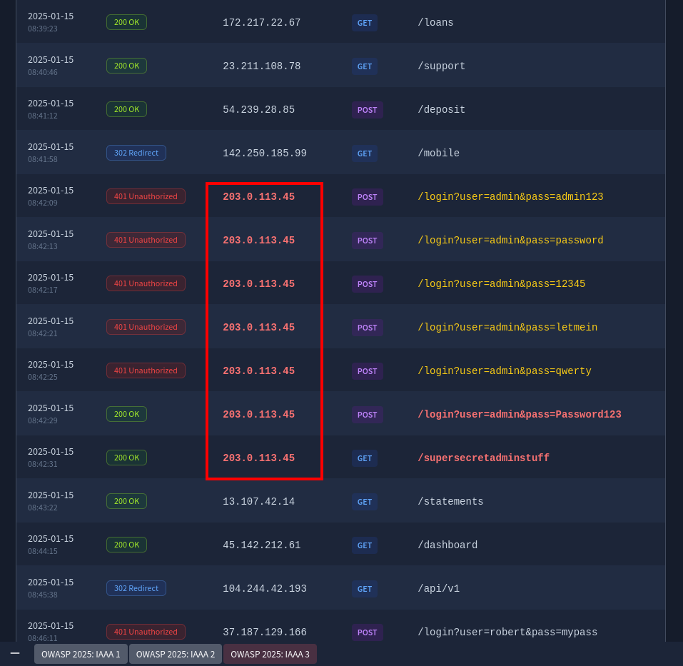
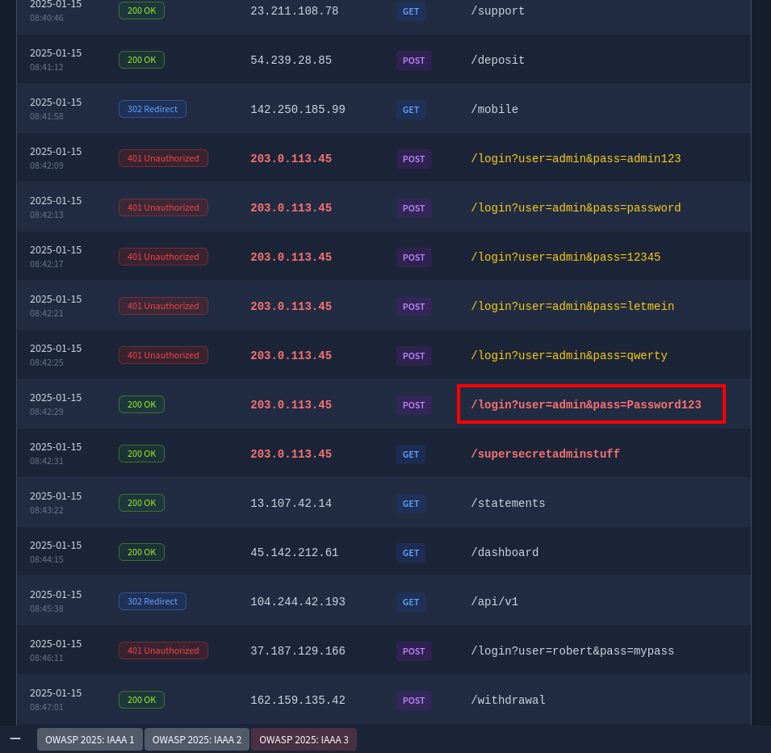
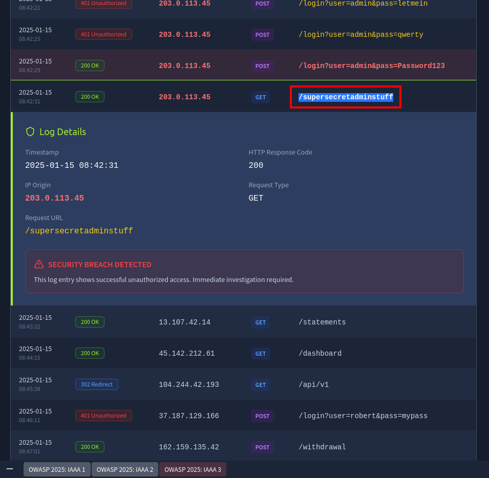

# OWASP Top 10 2025: IAAA Failures Walkthrough Notes | TryHackMe

Author: w4nn4d13  
Date: 15 April 2026

## Task 2: What is IAAA?

Question: What does IAAA stand for?  
Answer: Identity, Authentication, Authorisation, Accountability

---

## Task 3: A01 Broken Access Control

Question: If you do not get access to more roles but can view another user's data, what type of privilege escalation is this?  
Answer: Horizontal

Question: What is the note found when viewing the account with more than $1 million?  
Answer: THM{Found.the.Millionare!}

Solution path used:

    ?id=7

Evidence:

---

## Task 4: A07 Authentication Failures

Question: What is the flag on the admin user's dashboard?  
Answer: THM{Account.confusion.FTW!}

Solution summary:
1. Register a lookalike username: aDmiN
2. Log in with the created account
3. Access the account dashboard and capture the flag

Evidence:

---

## Task 5: A09 Logging and Alerting Failures

Question: It looks like an attacker tried brute-force. What is the attacker IP?  
Answer: 203.0.113.45

Question: What username was associated with successful access?  
Answer: admin

Question: What action/endpoint did the attacker try with that account?  
Answer: supersecretadminstuff

### Evidence Screenshots

---

## Final Notes

This room demonstrates how weak access control, account confusion, and poor alerting can chain together into account compromise and sensitive endpoint access.
